# Smartisan Icon Style LoRA (SDXL)

> A LoRA model trained on ~2200 skeuomorphic 3D Smartisan-style app icons.  
<p align="center">
  
  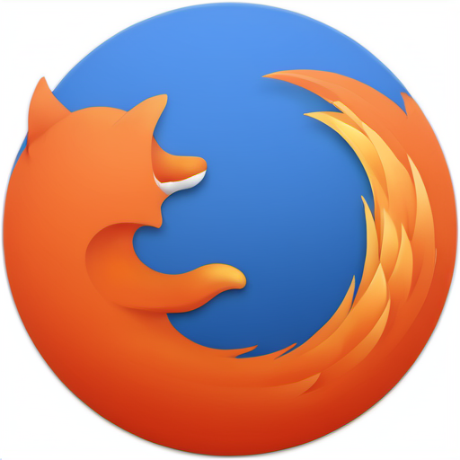
  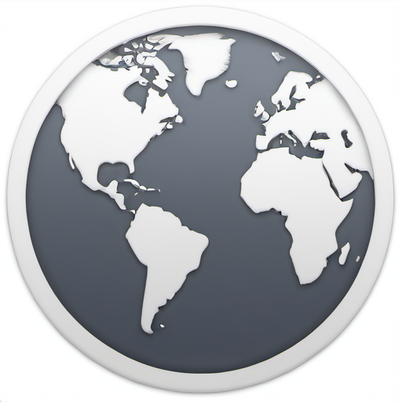
  
  
  
</p>
<p align="center">
  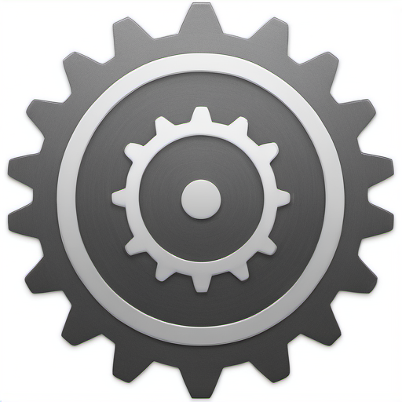
  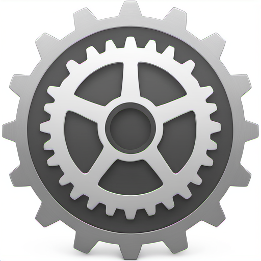
  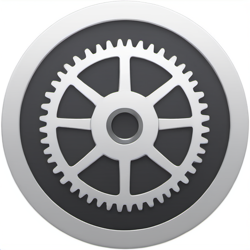
  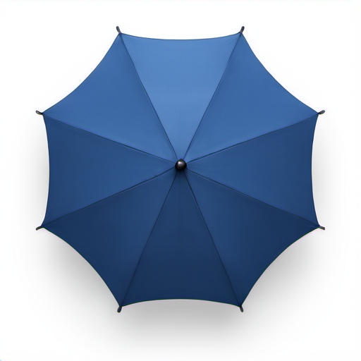
  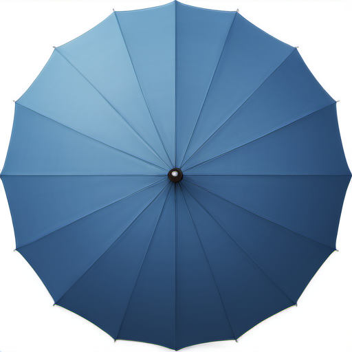
  
</p>

<p align="center">
  <em>Examples generated using the Smartisan Icon Style LoRA</em>
</p>

This LoRA enables Stable Diffusion XL (SDXL Base 1.0) to generate premium-quality skeuomorphic icons with:

- Glossy and realistic material rendering  
- Soft ambient shadows and AO shading  
- Rounded bevels and clean geometry  
- High-end industrial-design aesthetics  
- Consistent Smartisan-style visual language

---

## Overview

- **Base Model:** SDXL Base 1.0  
- **LoRA Type:** Standard UNet LoRA  
- **Training Tool:** kohya_ss  
- **Training Dataset:** ~2200 curated Smartisan-style icons  
- **Caption Format:**  [icon-name] icon, skeuomorphic 3d style, <smartisan-icon>

This model is ideal for generating app icons, tool icons, weather icons, system icons, and any UI-related graphic that benefits from a skeuomorphic, polished 3D style.

---

## How to Use (Stable Diffusion WebUI)

### 1. Place the LoRA file
Copy the `.safetensors` file into:

```
stable-diffusion-webui/models/Lora/
```

### 2. Select correct base model
Use **SDXL Base 1.0** (not SD1.5 / SD2.1 / Turbo).

### 3. Recommended generation settings

| Parameter | Recommended |
|----------|-------------|
| **Sampler** | DPM++ 2M Karras / Euler a |
| **CFG Scale** | 4 – 7 |
| **Resolution** | 512×512 |
| **LoRA strength** | 0.7 – 1.0 |

---

## Prompt Guide

### Prompt Structure
This LoRA is trained on structured captions, so the most reliable way to use it is to follow this format:
```
<lora:sdxl_SmartisanStyle_v1:STRENGTH>
<smartisan-icon> [OBJECT] icon, skeuomorphic 3d style, [ADDITIONAL STYLE DETAILS]
```
**Required components:**
- `<lora:LoRA_NAME:STRENGTH>` — activates the LoRA (recommended strength: **0.6–1.0**)
- `<smartisan-icon>` — special token learned during training  
- `[OBJECT] icon` — main subject  
- `skeuomorphic 3d style` — establishes the trained style  
- Additional material, lighting, and geometry descriptors improve quality

This structure ensures consistent Smartisan-style skeuomorphic icons.

### Basic-Level Prompt Examples
These prompts produce clean icons with minimal descriptive wording.  
They mirror the structure used during training.

#### Plane Icons:
```
<lora:sdxl_SmartisanStyle_v1:0.7> 
<smartisan-icon> plane icon, skeuomorphic 3d style, 
glossy reflections, rounded bevels, soft ambient shadow, smooth material finish
```
<p align="center">
  
  
  
  
</p>

#### Orange Icons:
```
<lora:sdxl_SmartisanStyle_v1:0.75>
<smartisan-icon> orange icon, skeuomorphic 3d style, 
single object, centered composition, isolated subject,
glossy reflections, rounded bevels, smooth curved surface, 
soft ambient shadow, premium UI icon aesthetic
```
<p align="center">
  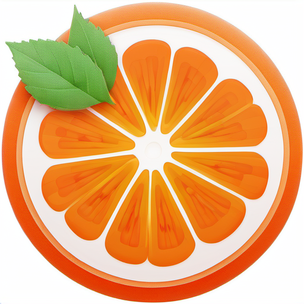
  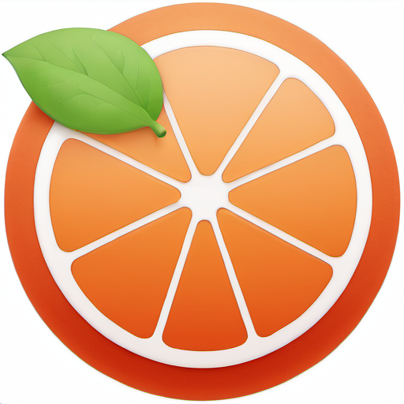
  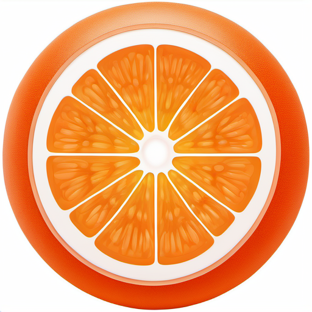
  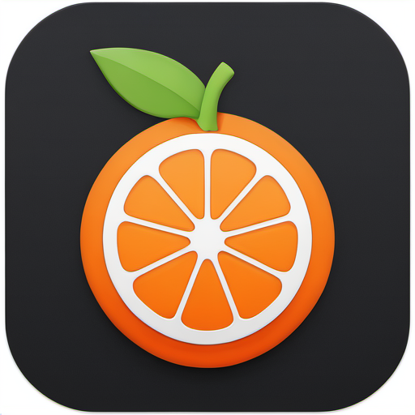
</p>

### Advanced-Level Prompt Examples

#### Airplanes soar through the sky:
```
<lora:sdxl_SmartisanStyle_v1:0.8>
<smartisan-icon> plane logo icon in front of a blue sky and white clouds background, skeuomorphic 3d style,
single centered subject, smooth rounded bevels, glossy highlights, clean geometric curvature,
soft ambient shadow beneath the plane, subtle inner glow separating the plane from the sky,
premium UI icon aesthetic, realistic lighting, balanced composition
```
<p align="center">
  
  
  
  
</p>

#### A black book with an orange logo:
```
<lora:sdxl_SmartisanStyle_v1:0.7>
<smartisan-icon> black book icon with an orange fruit logo on the cover, skeuomorphic 3d style,
single object, centered composition, isolated subject, smooth rounded bevels,
glossy reflections on the cover surface, subtle inner shadow around the edges,
premium UI icon aesthetic, soft ambient shadow, clean geometric curvature
```
<p align="center">
  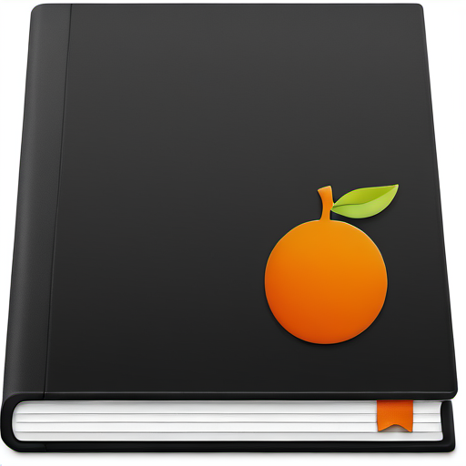
  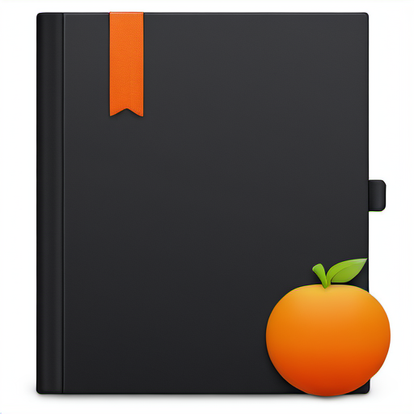
  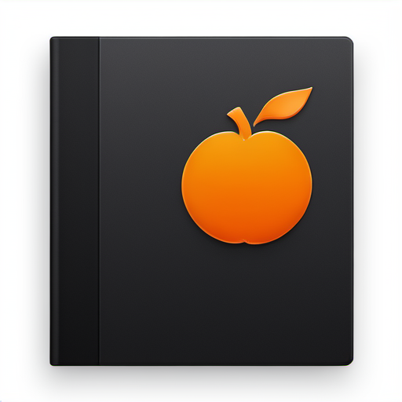
  
</p>

---

## Training Configuration Summary

This LoRA was trained using **kohya_ss** with the following key settings taken from the original training JSON.

### Model & Architecture

- **Base type:** SDXL (`"sdxl": true`)
- **LoRA type:** Standard UNet LoRA (`"LoRA_type": "Standard"`)
- **Network rank (`network_dim`):** 64
- **Network alpha (`network_alpha`):** 64
- **Train blocks:** all (`"train_blocks": "all"`)
- **LoRA save format:** `safetensors` with `fp16` save precision

```json
"sdxl": true,
"LoRA_type": "Standard",
"network_dim": 64,
"network_alpha": 64,
"train_blocks": "all"
```


### Base Model

The LoRA was trained on top of **SDXL Base 1.0**:
```json
"pretrained_model_name_or_path": "sd_xl_base_1.0.safetensors"
```

### Caption style:
- **Image format**: PNG app icons
- **Caption files**: one .txt per image

```json
"caption_extension": ".txt",
"train_on_input": true,
"shuffle_caption": false
```

```
[icon-name] icon, skeuomorphic 3d style, <smartisan-icon>
```

### Resolution & Bucketing
The model was trained with SDXL-style resolution bucketing:

```json
"enable_bucket": true,
"min_bucket_reso": 256,
"max_bucket_reso": 1024,
"bucket_reso_steps": 64,
"max_resolution": "1024,1024",
"bucket_no_upscale": true
```

### Optimization
Core training hyperparameters:

```json
"optimizer": "AdamW",
"learning_rate": 0.0001,
"unet_lr": 0.0001,
"train_batch_size": 64,
"loss_type": "l2",
"lr_scheduler": "cosine",
"lr_warmup": 10,
"max_grad_norm": 1
```

### Precision & Memory
Precision and memory-related options:

```json
"mixed_precision": "no",
"cache_latents": true,
"xformers": "xformers",
"gradient_checkpointing": false,
"lowvram": false,
"highvram": false
```

### Epochs & Saving
Training length and saving behavior:

```json
"epoch": 10,
"save_every_n_epochs": 1,
"save_model_as": "safetensors",
"save_precision": "fp16"
```

---

## Version & Updates

This LoRA will continue to be iterated as new icon styles, better training techniques, and additional datasets become available.  
Updates may include improved style consistency, higher-quality rendering, expansion to new icon categories, or overall refinements based on community feedback.

### Version History
- **v1.0 — Initial Release (2025-12-10)**  
  - Trained on ~2200 Smartisan-style skeuomorphic icons  
  - Network dimension 64 / alpha 64  
  - Added example prompts (basic + advanced)  
  - Included showcase images and training configuration summary
